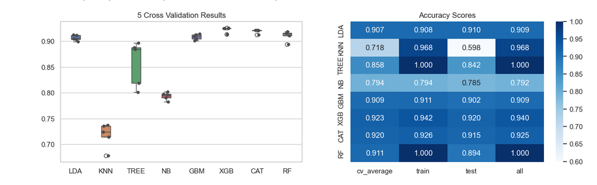
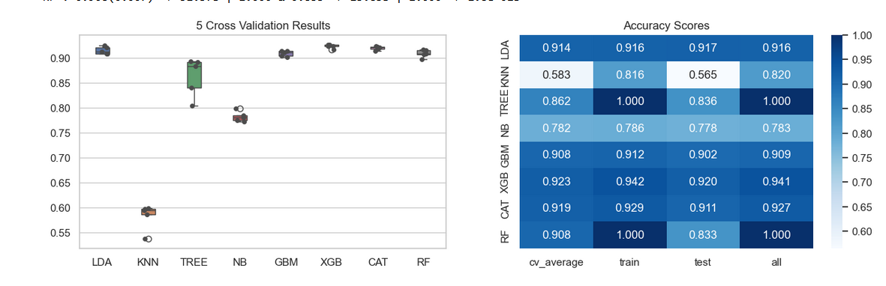
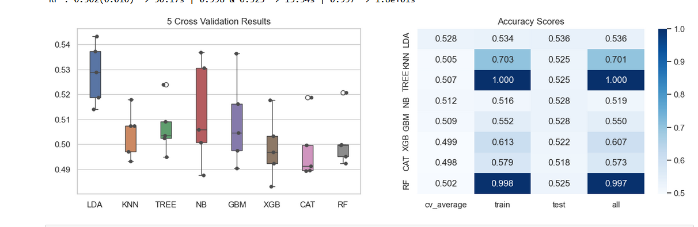
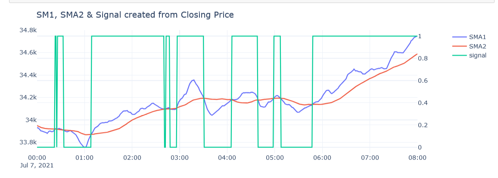
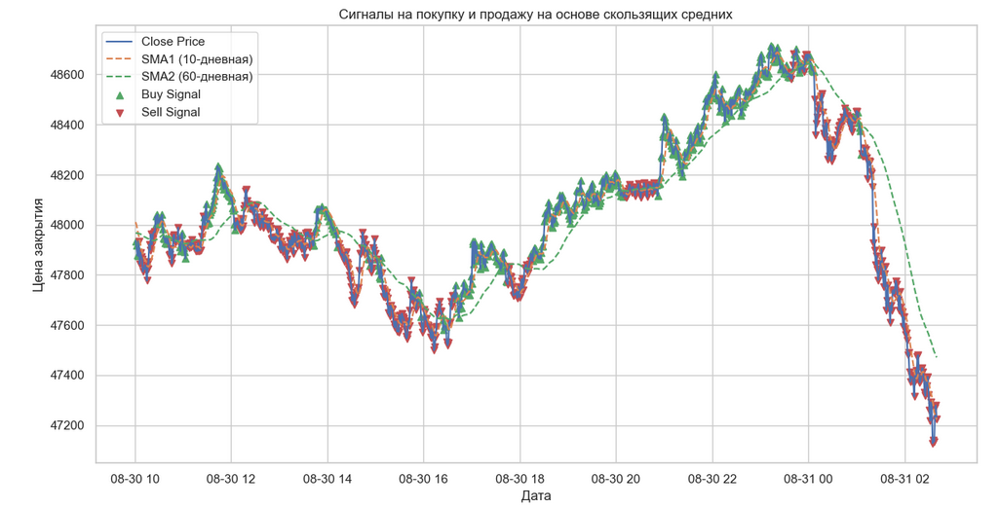

**A major drawback of cryptocurrency trading is the volatility of the market.** 

1. **The market will rise** (take a long position)
2. **The market will fall** (take a short position)
3. **The market will move sideways** (take no position)

The problem of predicting a buy (value = 1) or sell (value = 0) signal for a trading strategy is defined within the classification framework.

### Importance of Data Harvesting and Feature Engineering

Data harvesting (data collection in this context) and feature engineering are relevant factors in improving time series models. It's interesting to investigate whether traditionally stock-oriented feature engineering modifications are relevant to digital assets, and if so, which ones.

# Feature engeneering and Feature Important

# Feature engeneering without Feature Important

# Without Feature engeneering

# Multi trace

# Train SMA1 SMA2

